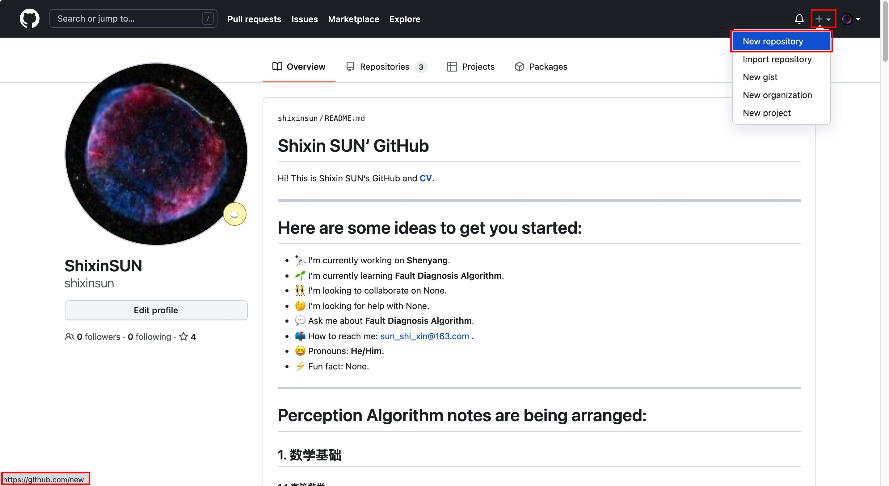
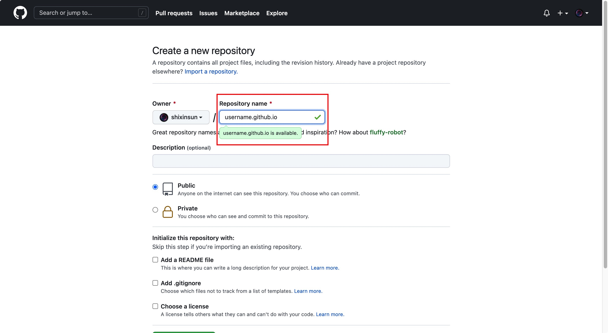
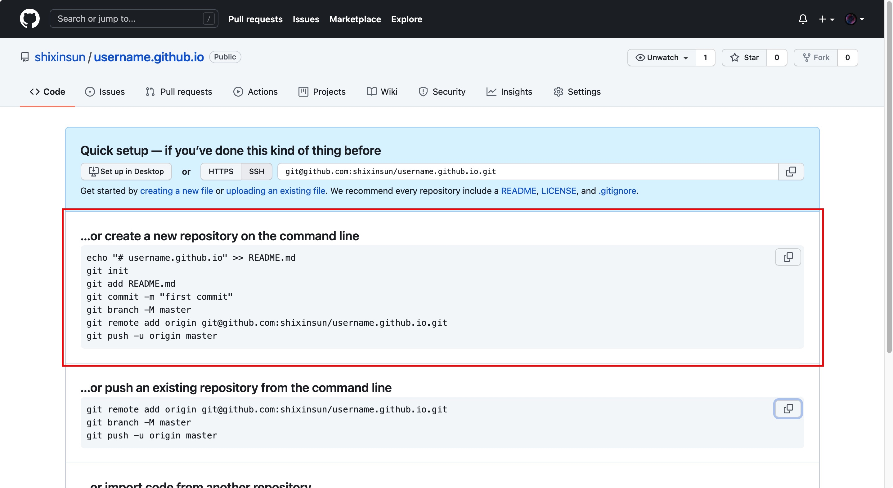
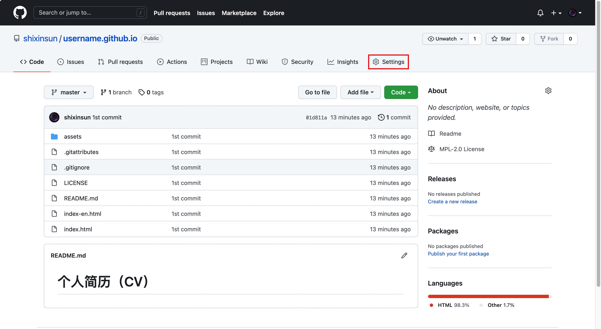
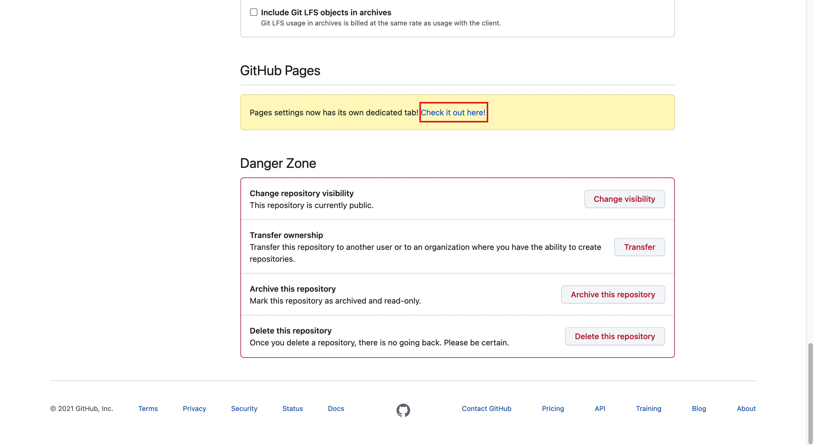
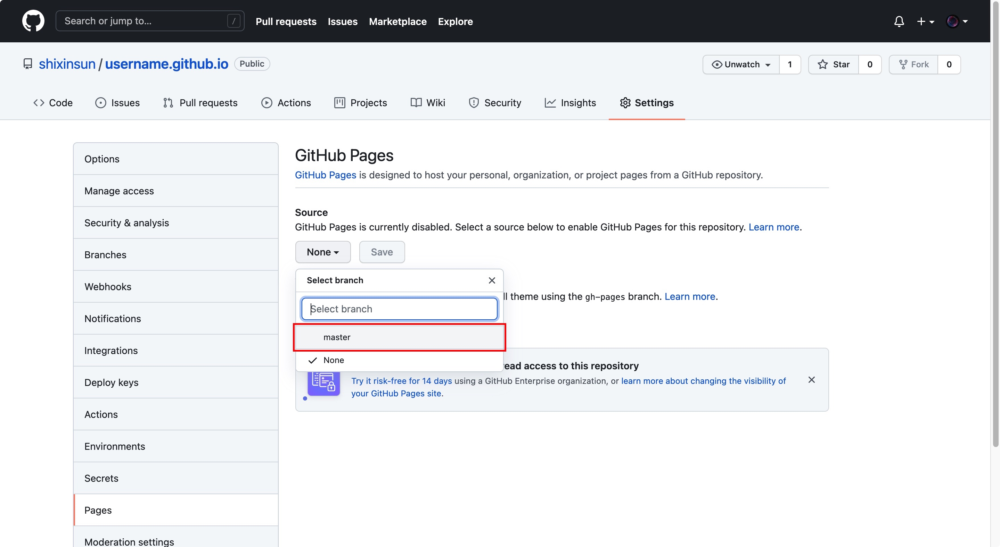
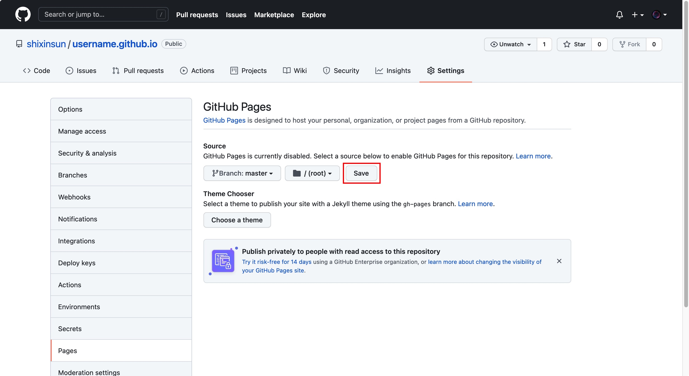
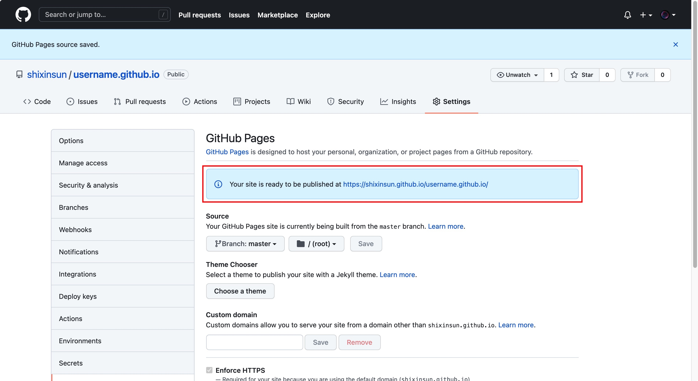

# 个人简历（CV）

## 简介

部署在 GitHub 上的个人简历可以随时更新维护，保证内容的实时性，方便对外展示，而不必像 Word 版个人简历那样，每次更新都需要通过邮箱、微信等通信工具重新发送，避免了繁琐的操作。即使需要纸质版的个人简历，也可以在网页上直接打印，或者导出为 PDF 再打印。因此，在 GitHub 上部署个人简历是一件省时省力，且正确的事情。

## 部署

1. 在开源的个人简历模版项目中，编辑 index.html 文件的相应位置，从而完成个人简历的编写；

2. 在 GitHub 中，点击右上角的 "+"，再点击 “New repository” 创建一个新仓库，或直接输入网址 <https://github.com/new>；

   

3. 在 “Repository name” 中输入 username.github.io 或 username.github.com，其中 username 可以是任何名字；

   

4. 此时，仓库中还没有任何内容，当我们把 index.html 及其相关文件按照下述代码推送到此仓库后，就可以通过 `https://username.github.io/` 访问个人简历的网站了；

   ```bash
   git init
   git add README.md
   git commit -m "first commit"
   git branch -M master
   git remote add origin git@github.com:shixinsun/username.github.io.git
   git push -u origin master
   ```

   

5. 如果 `https://username.github.io/` 显示无法访问，可能是还需要进行一些设置。点击 “Settings” 后下拉到 “GitHub Pages” 一栏，点击 “Check it out here”；

   

   

6. 在 “Source” 一栏中，选择 “master” 这一 branch 后，点击 “Save” 保存；

   

   

7. 待出现 “Your site is ready to be published at `https://username.github.io/`”，就表示 `https://username.github.io/` 已经可以访问了。

   

> 注：如果不想再访问个人简历网站，有多种方法可供选择：
>
> 1. 在 “Source” 一栏中，选择 “None” 这一 branch 后，点击 Save 保存。不过，此方法他人还是可以通过访问相应的 GitHub 仓库看到 index.html 文件；
> 2. 在 “Change repository visibility” 一栏中，将 “public” 改为 “private”，这样只有自己才能访问相应的 GitHub 仓库；
> 3. 在 “Delete this repository” 一栏中，直接将相应的 GitHub 仓库删除，如此只可在本地仓库查看相应的文件。

## 参考文献

1. [毕小朋. 了不起的 Markdown[M]. 北京: 电子工业出版社, 2019. 184 - 188.](http://product.dangdang.com/27912444.html)
2. [hack-hu 的 GitHub](https://github.com/hackhu2019/hackhu2019.github.io)
3. [镜花水月 的 Gitee](https://gitee.com/itsay/resume)

